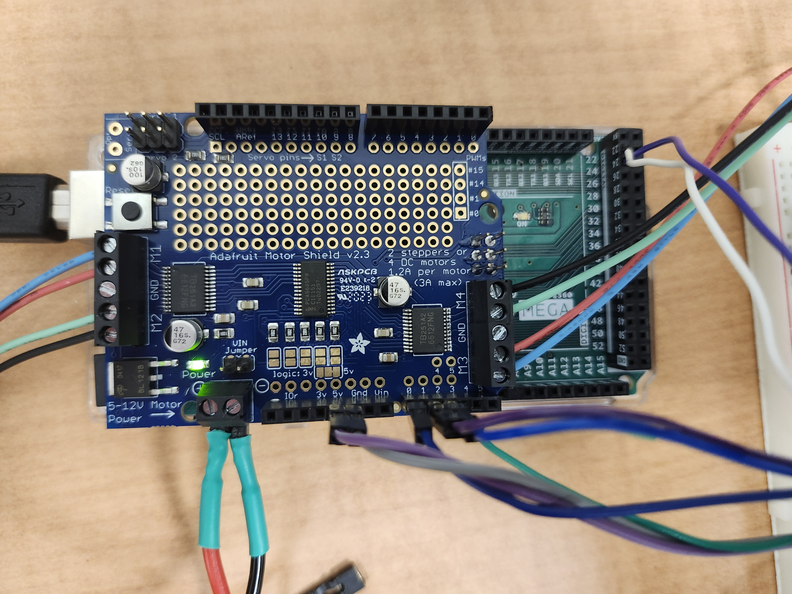
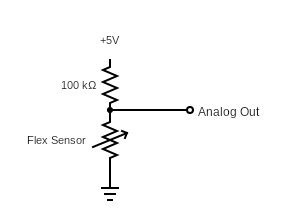
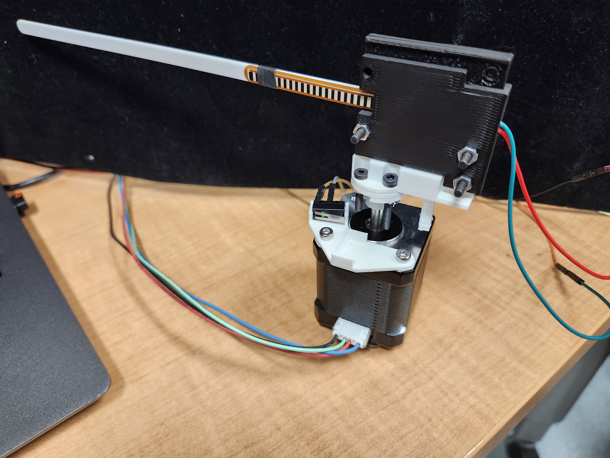

# flexSensor_array

# Software
Check scripts for the majority of the documentation. 3 scrips are included here:
- **flexSensorArray_control.ino** firmware to be loaded onto an Arduino Mega
- **flexlib.py**  python library that provides an api to control the flex sensor array and read signals. 
designed to be imported into an ipython notebook
- **controller_notebook.ipynb** notebook used to control the experiment. contains examples for using the flex
sensor array. designed to be the software interface for the project
## Arduino Software
It is recommended to install Arduino IDE 2 on your machine, install required 
libraries with the Arduino Library Manager, then upload the flexSensorArray_control.ino 
onto your Arduino Mega  

You should not need to do anything besides load the flexSensorArray_control.ino 
onto your Arduino. The only change to the code I might suggest is to 
reduce the baud rate if you're encountering too many communication errors. Make sure to edit the BAUD_RATE 
in the flexlib file to match if you do  

### Additional Required Libraries
These should all be available in the Arduino Library Manager
- Adafruit_MotorShield
- TimerOne
- AccelStepper
## Python
controller_notebook is designed to be the interface with this project, and 
ideally is the only file that should be edited. You will need to use a local notebook
(i.e. not colab, jupyter notebook recommended) as communication with the Arduino 
occurs via serial.
### Additional Required Libraries
- pyserial
- pandas
- matplotlib (optional but recommended)

# Hardware
## Parts
- Arduino Mega
- [Adafruit Motor Shield V2](https://learn.adafruit.com/adafruit-motor-shield-v2-for-arduino/overview)  and header pins
- 3.3 V, 1.5 or 3 Amp power supply (for 1 or 2 motors respectively)
- [Stepper motor](https://www.moonsindustries.com/p/nema-17-standard-hybrid-stepper-motors/ms17hd6p4150-000004611110008904)
- [Motor shaft coupler](https://www.amazon.com/QCQIANG-Coupling-Coupler-Flanged-Handmade/dp/B09TQM6F17?th=1)
- [Limit switch](https://www.digikey.com/en/products/detail/omron-electronics-inc-emc-div/D2FS-FL-N/4753388)
- [Flex sensor](https://www.adafruit.com/product/1070)
- [Flex sensor clincher connector](https://www.sparkfun.com/products/14195)
- 3D printed whisker
- 3D printed 2-sided whisker bracket
- 3D printed homing tab
- 3D printed motor mount
- ~100 kOhm resistor
- M3 harware
- Various wires and breadboard
## Microcontroller and Motorshield
This project was designed to be run on an Arduino Mega and use
[Adafruit Motorshields V2](https://learn.adafruit.com/adafruit-motor-shield-v2-for-arduino/overview) 
If you are stacking shields, make sure to solder the address bits. When initializing software, pass in 
the integer value of the address pins soldered (e.g. if you solder the two rightmost pins, 
the address would be 3 - 00011 in binary).

Each Arduino can support up to 16 whiskers and up to 16 stacked shields (though only up to a few shields are 
expected to be used). Each shield can support up to 2 stepper motors. 

## Power
The [stepper motors](https://www.moonsindustries.com/p/nema-17-standard-hybrid-stepper-motors/ms17hd6p4150-000004611110008904)
provided are rated for 1.5 amps, and the coils have a resistance of 2.2 ohms. Thus, a 3.3 V power supply 
that can provide 3 amps is recommended if you plan to run 2 motors on one motor shield.
3 amps is also the limit for the motor shields. Be careful of motors overheating and chips on the 
motor shield burning out if you go above 3.3 volts. You can plug power into the Arduino barrel jack 
and put the power jumper on the shield, or hook up power to the power terminal on the motor shield.  

## Wiring
### Arduino and Motor Shield
The Arduino pictured below is wired for 2 motors with 2 whiskers each. Note the order of the colored wires 
connected to the motor shield motor terminals. Whisker outputs should be wired in the order you wish 
them to be referenced starting at A0. Limit pins should be connected in the even numbered pins starting 
at 22. Make sure these are wired in the same order that you initialize the motors. For example, if your 
motor string is '21' and you have 2 whiskers per column, plug the limit pin associated with the
motor connected to second stepper terminal
(M3 and M4) into pin 22 and the limit pin associated with the motor in the first stepper terminal 
to pin 24. Then hook up the whiskers on stepper 2 to A0 and A1 and the whiskers on stepper 1 
to A2 and A3.

### Whiskers
This project is designed to use a voltage divider circuit to read the signals from the whiskers. 
Wire a resistor between +5V and one end of your whisker sensor. This is your output, also wire it to 
one of the analog pins on the arduino. Wire the other end of the whisker sensor to ground. It may take 
some tuning to figure out the best resistor value to use to get the best signal range without saturating 
the signal. I found around 100 kOhms to be a good value (I used 2 200 kOhm resistors in parallel). 
The flex sensor resistance is about 25 kOhms at rest with resistance increasing as it bends. Note 
that the Arduino is using a reference voltage of 1.1 V for reading the analog signal, so you do not 
want your output voltage to go above 1.1 V.

### Limit Switch
The two pins closest to the green button/lever hinge are the active pins on the limit switch. One should 
be wired to one of the even numbered pins starting at 22 on the Arduino, and the other to ground.  

Note that there are two places you may place the limit switch on the 3D printed limit switch holder. One 
is designed to trigger when the whiskers are at "-90°", or parallel to 2 sides of the square motor. The 
other is 72° away from this. Chose whichever best fits your needs, but the default control parameters were 
chosen when using the "72°" slot as shown below.

## Assembly of other components
Image of assembled whisker column:

A few tips:
- All hardware components use M3 screws
- A screw can be removed from the motor housing to allow for the screws holding the limit switch 
holder to be screwed in all the way
- The tip of the flex sensor should be only loosely held by a band, as it needs to slide as the whisker flexes. 
Tape the back of the band if necessary to prevent it from moving along the whisker. Some heat shrink was provided to use as 
this band, apply heat to make it tighter
- Ensure the flex sensor is straight when closing the clincher connector
- The 3D printed motor shaft couplers have a hole that allows you to use an M3 screw as a set screw. I may have made the hole diameter a bit too large
as the set screws easily strip the plastic hole. Try wedging something thin along the 
flat side of the shaft or taping the shaft to tighten the fit if this is a problem. Or try a larger diamter screw if you have one available.

